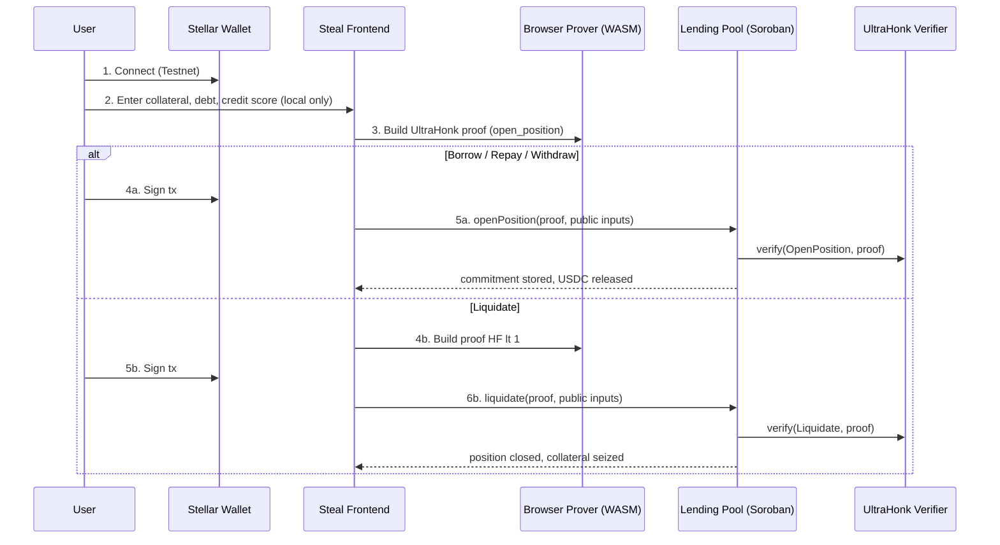
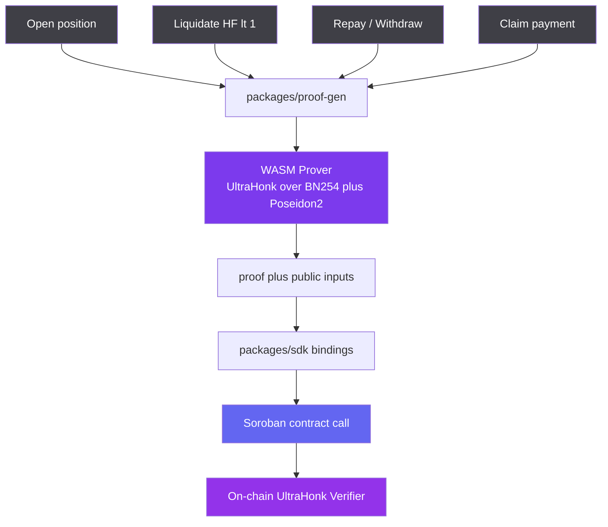

<p align="center">
  
</p>

<h1 align="center">Steal</h1>

<p align="center">
  Confidential lending on Stellar — borrow USDC with collateral, debt, and credit
  scores hidden behind zero-knowledge&nbsp;proofs.
</p>

<p align="center">
  
  
  
  
  
</p>

<p align="center">
  <a href="#quick-start">Quick Start</a> ·
  <a href="#how-it-works">How It Works</a> ·
  <a href="#architecture">Architecture</a> ·
  <a href="#smart-contracts">Contracts</a> ·
  <a href="#circuits">Circuits</a>
</p>

> ⚠️ **Testnet only · unaudited · honest work-in-progress.** Several components are
> deliberate stubs (see [Honest Stubs](#honest-stubs)) — most importantly the on-chain
> UltraHonk verifier, which currently sanity-checks rather than cryptographically
> verifies. Do not use with real funds. Built for the **Stellar Hacks: Real-World ZK**
> hackathon.

---

## Overview

Steal (protocol codename *Eclipse*) is a confidential lending dApp built on **Soroban**
with **client-side ZK proving** and **on-chain UltraHonk verification**. A borrower
deposits XLM collateral and borrows USDC where the amounts — and the credit score that
sets their borrow limit — stay hidden behind **Poseidon2 commitments**. Zero-knowledge
proofs attest that a position is healthy without ever revealing the numbers, and an
auditor can decrypt a full position on demand using a view key the borrower shares.

Every proof is generated **in the browser (WASM)** with Noir + Barretenberg (UltraHonk
over BN254), so private inputs never leave the device. The Soroban lending pool verifies
each proof on-chain before it moves money.

> **One pool. Three roles. One rule: your numbers stay private unless you choose to reveal them.**
>
> - **Borrow** deposits collateral and opens a position — amount, debt, and credit score hidden.
> - **Liquidate** proves a position is unhealthy and closes it — without ever seeing its values.
> - **Audit** decrypts a full position with a borrower-shared view key, for compliance.
>
> Plus **confidential payment links**: lock USDC behind a commitment, share a link, and
> the recipient claims it with a ZK proof — no amount on the public ledger.

---

## Table of Contents

- [Quick Start](#quick-start)
- [Why Steal](#why-steal)
- [The Three Roles](#the-three-roles)
- [How It Works](#how-it-works)
- [Architecture](#architecture)
- [Tech Stack](#tech-stack)
- [Key Files](#key-files)
- [Smart Contracts](#smart-contracts)
- [Circuits](#circuits)
- [Honest Stubs](#honest-stubs)
- [Deployment](#deployment)
- [Hackathon](#hackathon)
- [License](#license)

---

## Quick Start

> This is a **monorepo with three independent toolchains** that are deliberately kept
> side by side — do not try to unify them. All `pnpm` commands run from the repo root.

| Layer | Tool | Location |
|---|---|---|
| ZK circuits | `nargo` (Noir) + `bb` (Barretenberg) | `circuits/` |
| Smart contracts | `cargo` + `stellar` CLI (`soroban-sdk`) | `contracts/` |
| Frontend + TS libs | `pnpm` + Next.js / `tsc` | `web/`, `packages/*` |

### Prerequisites

- Node.js 20+ and **pnpm** ≥ 9
- Rust + `cargo` (for contracts)
- `nargo` (Noir) and `bb` (Barretenberg) — installed by `pnpm setup`
- The `stellar` CLI (for deploys)
- A Stellar wallet on Testnet — [Freighter](https://www.freighter.app/), Lobstr, or xBull

### Install & run the frontend

```bash
git clone https://github.com/maulana-tech/steal-main.git
cd steal-main

pnpm install
pnpm dev          # http://localhost:3000
```

Routes: the marketing landing page is at `/`, and the app is at `/app`. The three roles
live at `/borrower`, `/liquidator`, `/auditor`; confidential payment links at
`/pay/create` and `/pay/claim/[commitment]`.

### Full toolchain (circuits + contracts + deploy)

```bash
cp .env.example .env          # then fill DEPLOYER_SECRET (testnet key)
pnpm setup                    # installs nargo, bb, stellar CLI; funds a testnet account

pnpm build:circuits           # nargo compile → web/public/circuits/*.json, then gen-vk.mjs → *.vk.json
pnpm build:contracts          # cargo/soroban build all contracts → wasm
pnpm deploy                   # stellar CLI deploys contracts, writes IDs to .env + web/.env.local
```

> `pnpm deploy` writes contract IDs idempotently — both deploy paths strip the existing
> `*_ID` lines and rewrite them, so re-deploys overwrite rather than accumulate. The SDK
> reads only those env vars ([`packages/sdk/src/config.ts`](./packages/sdk/src/config.ts));
> never hardcode contract IDs elsewhere. Full walkthrough:
> **[docs/DEPLOYMENT.md](docs/DEPLOYMENT.md)**.

---

## Why Steal

Stellar is transparent by design: every amount and balance is public and permanently
indexed. For real-world credit — a business borrowing against treasury, a payroll float,
an under-collateralized loan gated on reputation — that transparency is a liability.

The existing options fall short:

- **Public lending protocols** expose your collateral, your debt, and your liquidation
  threshold to anyone watching — an open invitation to targeted liquidation.
- **Off-chain / custodial credit** means surrendering custody and trusting an operator's
  books, re-introducing the counterparty risk DeFi was meant to remove.
- **"Just use a fresh wallet"** still links back to the funding source on the public
  graph, and it can't express a *credit score* without doxxing it.
- **Naive "hide the number" tricks** prove nothing — without a real ZK circuit and an
  on-chain verifier, there's no guarantee the hidden position is actually solvent.

**How might we let someone borrow on Stellar with the amounts and credit score hidden,
prove the position is healthy on-chain, and still allow a compliant audit on demand?**

Steal answers with a handful of core primitives on the Soroban stack:

1. **Client-side proving (WASM)** — proofs are built in the browser with Noir + bb.js
   (UltraHonk over BN254, Poseidon2 hashing). Secret inputs (collateral, debt, score,
   salts) never leave the device.
2. **Committed positions** — collateral and debt live on-chain as Poseidon2 commitments,
   not plaintext. The ledger stores a hash, never the number.
3. **Health proven, not shown** — the `open_position`, `liquidate`, and `repay_withdraw`
   circuits attest that a position is solvent (or *insolvent*, for liquidation) at the
   current oracle price without revealing any value.
4. **Credit as a private attestation** — a credit score arrives as a Poseidon2
   attestation and unlocks a higher LTV (up to 120%, under-collateralized) without the
   score ever appearing on-chain.
5. **View-key auditing** — the borrower encrypts their full position to a view key; an
   auditor decrypts it for compliance, but no one else can.
6. **Confidential payment links** — lock USDC behind a commitment and share a link; the
   recipient claims it with a `claim_payment` proof and a nullifier, so the amount and the
   sender → receiver link stay off the public ledger.

<details>
<summary><b>Meet Maya</b> — the person this is for</summary>

<br>

Maya runs a small trading desk and wants to borrow USDC against her XLM treasury to cover
a short-term position. On a public lending protocol, everyone can see her collateral size,
her outstanding debt, and — critically — the exact price at which she'd be liquidated. Bots
watch that threshold and front-run it; a competitor can read her whole balance sheet off
the explorer.

Maya doesn't want to leave Stellar, and she doesn't want to hand her funds to a custodian.
She wants to post collateral, borrow against it, and have her amounts and her
liquidation point stay private — while still being able to *prove*, on-chain, that her
position is healthy, and to hand a regulator a view key if she's ever asked.

Her problem isn't a missing chain. It's that there's no way to take a Stellar loan where
the numbers are hidden, the solvency is proven, and custody is never surrendered.

</details>

---

## The Three Roles

Steal runs three roles against one lending pool. Each role is a ZK proof verified on-chain
before anything moves — the only thing that changes is *what* is being proven and who signs.

|  | **Borrow** | **Liquidate** | **Audit** |
|---|---|---|---|
| **Route** | `/borrower` | `/liquidator` | `/auditor` |
| **Circuit** | `open_position` | `liquidate` | none (decrypt) |
| **Proves** | collateral committed, score ≥ threshold, debt ≤ LTV, health factor ≥ 1 | health factor < 1 at current oracle price | — |
| **Signer** | the borrower's wallet | the liquidator's wallet | the auditor (view key, off-chain) |
| **On-chain effect** | position commitment stored, USDC borrowed | position closed, collateral seized | read-only |
| **What stays hidden** | collateral, debt, and credit score | the position's actual values | nothing — full decrypt, by design |

A fourth flow, **confidential payment links** (`/pay/create` → `/pay/claim/[commitment]`),
uses the `claim_payment` circuit to release locked USDC against a nullifier so the payment
amount and the sender → receiver link never hit the public ledger.

```
Open position  -> prove: committed collateral, score >= threshold, debt <= LTV, HF >= 1
Liquidate      -> prove: HF < 1 at the current oracle price
Repay/Withdraw -> prove: the updated position still has HF >= 1
Claim payment  -> prove: knowledge of the secret behind a locked commitment; burn a nullifier
```

---

## How It Works

**Borrower flow** — `Connect → Deposit collateral → Borrow privately → Repay / Withdraw`

1. **Connect** a Stellar wallet on Testnet (Freighter / Lobstr / xBull) and fund it with the in-app faucet if needed.
2. **Open a position**: choose a collateral amount, debt, and credit score locally; the browser proves the position is healthy and commits it on-chain.
3. **Borrow** USDC up to the LTV your (hidden) credit score unlocks — 50% / 75% / 120%.
4. **Repay or withdraw** any time; a fresh proof shows the updated position still has health factor ≥ 1.
5. **Share a view key** with an auditor if you ever need the position decrypted for compliance.

**Proof flow (browser)** — `Derive inputs → Build circuit witness → Prove (UltraHonk) → Submit`

1. **Collect** your private inputs (collateral, debt, score, salts) — they never leave the device.
2. **Witness** is built for the relevant Noir circuit (`open_position` / `liquidate` / `repay_withdraw` / `claim_payment`).
3. **Prove** UltraHonk over BN254 with Poseidon2, client-side via bb.js + Noir WASM (~10–30s).
4. **Submit** the proof and public inputs to the Soroban contract, which verifies before acting.

**On-chain flow**

```
Wallet                    Lending Pool (Soroban)          Verifier
   |                            |                              |
Open position -------------->|                              |
   |                            |-- verify(OpenPosition, proof)-->|
   |                            |-- store position commitment  |
   |                            |-- release USDC               |
   |                            |                              |
Liquidate ------------------>|                              |
   |                            |-- verify(Liquidate, proof)-->|
   |                            |-- close position, seize      |
   |                            |                              |
   <-- tx hash. Amounts and credit score never appear on-chain.|
```

---

## Architecture

```
Frontend (Next.js, /app)   →  Noir + bb.js WASM (client-side proof)
                           →  @stellar/stellar-sdk (tx submission)
                                ↓
Soroban (Stellar Testnet):
  LendingPool              →  position commitments, USDC pool, calls the verifier
  UltraHonkVerifier [STUB] →  stores VKs per circuit; real impl = rs-soroban-ultrahonk
  Oracle [STUB]            →  admin-set XLM/USD price
  CreditIssuer [STUB]      →  mock Poseidon credit attestation
  PaymentPool              →  lock / claim confidential payment links
```

### System flow



### Proof pipeline



The data that flows between the three toolchains: circuits compile to artifacts that land
in `web/public/circuits/` so the browser can prove; contracts deploy and their IDs flow
into `web/.env.local`; the SDK package is the single place the frontend and scripts read
contract addresses. See [`docs/ARCHITECTURE.md`](docs/ARCHITECTURE.md) for detail.

---

## Tech Stack

| Layer | Technology |
|---|---|
| Frontend | Next.js 14 (App Router), React 18, TypeScript, Tailwind CSS 3 |
| Landing UX | Lenis (smooth scroll), framer-motion, liquid-glass design system |
| Wallet | Stellar Wallets Kit 2.3 — Freighter / Lobstr / xBull |
| Blockchain | Stellar Testnet (Soroban), `soroban-sdk` 22.0.8 |
| Stellar SDK | `@stellar/stellar-sdk` 16 |
| ZK circuits | Noir (`nargo`), pinned to `0.36.0` |
| Proving backend | Barretenberg (`bb`) — UltraHonk over BN254 |
| Prover runtime | `@noir-lang/noir_js` + bb.js, client-side WebAssembly |
| Cryptography | Poseidon2 commitments, view-key encrypt/decrypt (`packages/crypto`) |
| Payment links | `@paulmillr/qr` (QR), base64url link fragments |
| Icons | `lucide-react` |
| Monorepo | pnpm workspace + Nargo workspace + Cargo workspace |

---

## Key Files

Every private action is a proof produced in the browser and verified on-chain by a Soroban
contract. The core integration points:

| Component | File | Description |
|---|---|---|
| **Shared circuit primitives** | [`circuits/common/src/lib.nr`](./circuits/common/src/lib.nr) | Poseidon2 `commit`, LTV schedule, health factor, credit attestation, nullifier — imported by every on-chain circuit |
| **Proof generation** | [`packages/proof-gen/src/index.ts`](./packages/proof-gen/src/index.ts) | Client-side bb.js + Noir WASM proving |
| **Crypto (TS)** | [`packages/crypto/src/index.ts`](./packages/crypto/src/index.ts) | TS Poseidon + view-key encrypt / decrypt |
| **SDK config** | [`packages/sdk/src/config.ts`](./packages/sdk/src/config.ts) | Testnet RPC, network passphrase, deployed contract addresses (from env) |
| **SDK bindings** | [`packages/sdk/src/index.ts`](./packages/sdk/src/index.ts) | `openPosition`, `liquidate`, `repayWithdraw`, `getPosition`, `createPayment`, `claimPayment`, `isPaymentClaimed` |
| **Lending Pool** | [`contracts/lending-pool/src/lib.rs`](./contracts/lending-pool/src/lib.rs) | Stores position commitments, manages the USDC pool, calls the verifier |
| **Verifier** | [`contracts/verifier/src/lib.rs`](./contracts/verifier/src/lib.rs) | Stores a VK per `CircuitId`; verifies proofs (currently a **stub**) |
| **Payment Pool** | [`contracts/payment-pool/src/lib.rs`](./contracts/payment-pool/src/lib.rs) | `lock` / `claim` for confidential payment links |
| **Payment helpers** | [`web/lib/payments.ts`](./web/lib/payments.ts) | Build / resolve payment links, nullifiers, base-unit conversion |
| **Role UI** | [`web/components/pages/(main)/RolePanel.tsx`](./web/components/pages/\(main\)/RolePanel.tsx) | Borrower / Liquidator / Auditor tabbed panel on `/app` |
| **Wallet** | [`web/components/wallet/WalletButton.tsx`](./web/components/wallet/WalletButton.tsx) | Stellar Wallets Kit connect / disconnect / faucet |
| **Landing** | [`web/components/pages/(main)/MainPage.tsx`](./web/components/pages/\(main\)/MainPage.tsx) | Multi-section marketing landing with Lenis smooth scroll |

RPC: `https://soroban-testnet.stellar.org` · Network passphrase: `Test SDF Network ; September 2015`

---

## Smart Contracts

### Addresses (Stellar Testnet)

| Contract | Address | Description |
|---|---|---|
| `LendingPool` | `CBZDSF7Z5F5QD3YISOERGYW6GRSICGNEACMKL6H2I4CIQHWU7HALRLWX` | Core: position commitments, USDC pool, calls the verifier |
| `UltraHonkVerifier` | `CDWIQUJ5VDPMA55R2SGO72VYJFYD4WLHMIADZ7UGATUVQ2DGVDA2EQEY` | Per-circuit VK store + proof verification (**stub**) |
| `Oracle` | `CDLKV4IOHUZR7RV4Y6DNDGR2KQ5EJ3AJ55EHSSOAWZA4ZDRXQEBESYXK` | Admin-set XLM/USD price (**stub**) |
| `CreditIssuer` | `CAYFRXZXTPVFZIX7QCKFTSOLCCY5OGLQIZ2KHPZR6WBIAWF4KBLBZK2M` | Mock Poseidon credit attestation (**stub**) |
| `PaymentPool` | *not yet deployed* | Confidential payment links (`lock` / `claim`) — code-complete; deploy writes `PAYMENT_POOL_ID` |

> Addresses come from `web/.env.local`, written by `pnpm deploy`. If you redeploy, they
> update in place.

### Key functions

```
# LendingPool
open_position(borrower, proof, ...)   verify open_position proof, store commitment, release USDC
liquidate(caller, proof, ...)         verify HF < 1, close the position, seize collateral
repay_withdraw(borrower, proof, ...)  verify the updated position still has HF >= 1

# Verifier
verify(circuit_id, proof) -> bool     circuit_id: OpenPosition=0, Liquidate=1, RepayWithdraw=2, ClaimPayment=3
register_vk(circuit_id, vk)           admin: store the verification key for a circuit

# PaymentPool
lock(sender, commitment, amount)      lock USDC behind a Poseidon2 commitment
claim(recipient, commitment, nullifier_hash, proof)   release funds against a claim_payment proof

# Frontend SDK (packages/sdk)
openPosition / liquidate / repayWithdraw / getPosition
createPayment / claimPayment / isPaymentClaimed
```

Contracts live in a Cargo workspace: `shared` (types/events), `verifier`, `oracle`,
`credit-issuer`, `lending-pool`, `payment-pool`. Release profile is `panic=abort`,
`opt-level=z`, LTO — standard Soroban size tuning.

---

## Circuits

The ZK system only works if hashing matches across Noir, Rust, and TypeScript. These
invariants are load-bearing — changing one in any language requires changing all three:

- **Commitment** = `Poseidon2([value, salt], 2)`
- **LTV schedule** (`ltv_bps`): score ≥ 700 → 120% (under-collateralized), ≥ 500 → 75%, else 50%
- **Credit attestation** = `Poseidon2([borrower_address, credit_score, issuer_nonce], 3)`
- **Nullifier** = `Poseidon2([secret_key, position_id], 2)`

| Circuit | On-chain `CircuitId` | Proves (without revealing) |
|---|---|---|
| `open_position` | `0` | collateral committed, score ≥ threshold, debt ≤ LTV, health factor ≥ 1 |
| `liquidate` | `1` | health factor < 1 at the current oracle price |
| `repay_withdraw` | `2` | the updated position still has health factor ≥ 1 |
| `claim_payment` | `3` | knowledge of the secret behind a locked commitment; a nullifier to prevent double-claim |
| `solvency` | — | *(stretch / recursive)* pool-level solvency; not verified on-chain |

`pnpm build:circuits` runs in two steps: `build-circuits.sh` compiles all circuits with
`nargo`, then `gen-vk.mjs` produces verification keys by running the `UltraHonkBackend`
from JS (the `bb write_vk` CLI is skipped — it crashes libunwind on macOS). Per-circuit
public vs private I/O is documented in [`docs/CIRCUITS.md`](docs/CIRCUITS.md).

---

## Honest Stubs

Per the hackathon's *"honest work-in-progress beats polished mystery"* ethos, several
components are deliberate stubs. Do not assume they are real:

| Component | Status | Notes |
|---|---|---|
| On-chain UltraHonk verifier | **STUB** | Sanity-checks only (proof non-empty, public inputs `% 32 == 0`) — does **not** cryptographically verify. Real impl: `rs-soroban-ultrahonk`. Migration guide: [`docs/PHASE3_REAL_VERIFICATION.md`](docs/PHASE3_REAL_VERIFICATION.md) |
| Oracle price | **STUB** | Admin sets XLM/USD manually — no real feed |
| Credit issuer | **STUB** | Mock Poseidon commitment — no real KYC / signature |
| Interest model | **Omitted (v1)** | No interest accrual in the MVP |
| Multi-asset collateral | **Omitted (v1)** | Single XLM collateral |
| View-key storage | **Local only** | Encrypted blob stored in-browser, not on IPFS |
| Payment Pool | **Code-complete, not deployed** | Contract + UI + circuit exist; `pnpm deploy` will register it |

When someone asks to "make X work for real," the target is usually replacing one of these
stubs — most often the verifier, per the Phase 3 guide.

---

## Deployment

The frontend is a standard Next.js app; the smart contracts deploy to Stellar Testnet via
`pnpm deploy`. Deploying means:

1. Fill `DEPLOYER_SECRET` in `.env` (a testnet key) and run `pnpm setup` once.
2. `pnpm build:circuits && pnpm build:contracts && pnpm deploy` — contract IDs are written
   to `.env` and, as `NEXT_PUBLIC_*` vars, to `web/.env.local`.
3. Host the `web/` app on any Next.js-capable host; it reads contract addresses from the
   `NEXT_PUBLIC_*` env vars at build time.

There are two deploy paths with the same outcome — `scripts/deploy.sh` (the `stellar` CLI,
used by `pnpm deploy`) and a pure-Node alternative (`scripts/deploy-node.mjs` +
`init-contracts.mjs` + `seed-node.mjs`) for when the CLI path isn't viable. The Node
scripts set `NODE_TLS_REJECT_UNAUTHORIZED=0` — **testnet only, never production**.

Full walkthrough and checklist: **[docs/DEPLOYMENT.md](docs/DEPLOYMENT.md)**.

---

## Hackathon

| | |
|---|---|
| **Event** | Stellar Hacks: Real-World ZK |
| **Track** | Real-World ZK |
| **Network** | Stellar Testnet |
| **Stack** | Noir + UltraHonk (Barretenberg) · Soroban · Poseidon2 / BN254 |
| **Jury signals** | real-world money ✓ · compliant privacy (view keys) ✓ · ZK verified on-chain ✓ |

See [`docs/DEMO.md`](docs/DEMO.md) for the 30–60 second walkthrough script.

---

## License

Steal is a hackathon project — **research / educational software, unaudited, testnet
only**. No formal license file has been added yet; treat the code as source-available for
the hackathon and do not use it with real funds. It builds on the Noir, Barretenberg, and
`soroban-sdk` ecosystems, which carry their own licenses.

---

<p align="center"><i>Your collateral, your debt, your credit score — private until you decide otherwise. Steal.</i></p>
